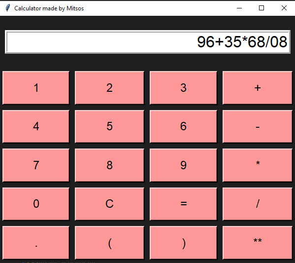

# Calculator made by Mitsos

A simple GUI calculator implemented with Python's Tkinter. This program provides a basic calculator interface with digits, arithmetic operators, parentheses and exponentiation. It was created as a small desktop utility and demo of Tkinter UI building.

## Features
- Basic arithmetic: `+`, `-`, `*`, `/`
- Parentheses: `(` `)`
- Decimal numbers (`.`)
- Exponentiation: `**`
- Clear (`C`) and evaluate (`=`) buttons
- Simple, responsive grid layout

## Requirements
- Python 3.7+ (recommended)
- Tkinter (usually included with standard Python distributions)
  - On some Linux distributions you may need to install the system package, e.g. `sudo apt install python3-tk`

## Installation
1. Clone the repository or copy the script into a file, for example `calculator.py`.
2. Ensure Python and Tkinter are installed on your system.

## Usage
Run the script with Python:

```bash
python3 calculator.py
```

The calculator window will open. Click the buttons to build an expression and press `=` to evaluate it. Press `C` to clear the current input.

## Screenshot




## Code overview
- The UI is built with Tkinter using a grid of `Button`s.
- `equation` is a `StringVar` bound to the `Entry` widget used as the display.
- `press(num)` appends the pressed button text to the `result` string and updates the display.
- `clear()` empties the input.
- `equalpress()` evaluates the `result` string using Python's `eval()` and shows the result or `Error` on exception.

## Security note — use of eval()
The program uses Python's built-in `eval()` to compute the entered expression. `eval()` will execute arbitrary Python code and therefore is unsafe if untrusted input is possible. For local, personal use this may be acceptable, but if you plan to distribute or harden the app you should replace `eval()` with a safe expression evaluator (e.g., `simpleeval`, `asteval`, `numexpr`) or implement a restricted parser (shunting-yard/AST-based evaluator).

## Potential improvements
- Add keyboard input handling so users can type expressions.
- Add a history of recent calculations.
- Add scientific functions (sin, cos, log) via a safe whitelist.
- Improve styling (colors, fonts) and make window resizable-friendly.

## Contributing
Contributions are welcome. Open an issue to propose changes or create a pull request with improvements. If you add functionality that extends expression parsing or evaluation, include tests and documentation explaining safety considerations.

## License
Choose a license for your project (for example MIT). If you want me to add a LICENSE file here, tell me which license you prefer and I can generate it.
